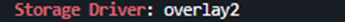
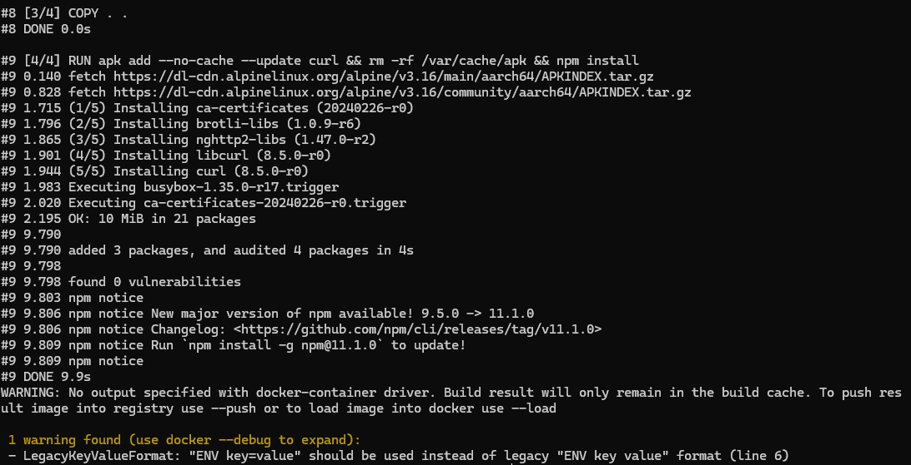
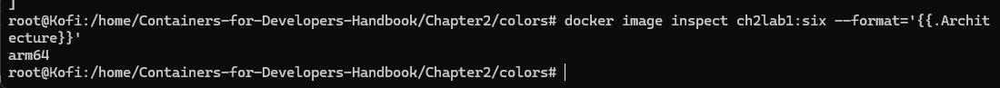

# Documentación Docker

## Instalar Docker:

### Actualizar paquetes
```sh
sudo apt update && sudo apt upgrade -y
```

### Instalar dependencias
```sh
sudo apt install -y ca-certificates curl gnupg lsb-release
```

### Agregar el repositorio de Docker
```sh
sudo mkdir -p /etc/apt/keyrings

curl -fsSL https://download.docker.com/linux/ubuntu/gpg | sudo tee /etc/apt/keyrings/docker.asc > /dev/null

echo "deb [arch=$(dpkg --print-architecture) signed-by=/etc/apt/keyrings/docker.asc] https://download.docker.com/linux/ubuntu $(lsb_release -cs) stable" | sudo tee /etc/apt/sources.list.d/docker.list > /dev/null
```

### Actualizar los paquetes
```sh
sudo apt update
```

### Ver las versiones de Docker
```sh
apt list -a docker-ce
```


### Instalar una versión específica
```sh
sudo apt install -y docker-ce=<version> docker-ce-cli=<version> containerd.io
```

---

## Correr Docker hello-world
```sh
docker run hello-world
```


---

## Ver el storage driver actual
```sh
docker info | grep "Storage Driver"
```

## Parar Docker
```sh
sudo systemctl stop docker
```

## Editar la configuración del Daemon
```sh
sudo nano /etc/docker/daemon.json
```
```json
{
  "storage-driver": "devicemapper"
}
```

## Eliminar data de Docker vieja
```sh
sudo rm -rf /var/lib/docker
```

## Iniciar Docker
```sh
sudo systemctl start docker
```

## Ver storage driver
```sh
docker info | grep "Storage Driver"
```

---

## Correr un contenedor


### Cambiar otra vez a overlay2
```sh
sudo systemctl stop docker
```

```sh
sudo nano /etc/docker/daemon.json
```
```json
{
  "storage-driver": "overlay2"
}
```

```sh
sudo systemctl start docker
```

### Verificar que devolvió
```sh
docker info | grep "Storage Driver"
```

---

## Correr una versión específica de Nginx
```sh
docker run --name my-nginx -p 8080:80 nginx:1.18.0
```

## Detener contenedor y borrarlo
```sh
docker kill 3aa969b970d8
docker rm 3aa969b970d8
```

## Correr en segundo plano
```sh
docker run -d --name my-nginx -p 8080:80 nginx:1.18.0
```

## Ver logs
```sh
docker logs -f my-nginx
```


---

## Configurar Nginx con nombre `nginx18`, reiniciar en fallos, mapear puerto 443 a 80, reservar 250M de memoria y usar la versión 1.18 de Nginx
```sh
docker run -d \
  --name nginx18 \
  --restart on-failure \
  --memory 250m \
  -p 443:80 \
  nginx:1.18.0
```


## Verificar contenedor
```sh
docker stats nginx18
```


## Parar y borrar el contenedor y correrlo con logging en journald
```sh
docker run -d --log-driver=journald --name nginx18 --restart on-failure --memory 250m -p 443:80 nginx:1.18.0
```

## Verificar el logging
```sh
journalctl -u docker.service --no-pager | grep nginx18
```


# Installing Rancher Desktop

- Download the installer from the following URL https://rancherdesktop.io/.


- Once downloaded, execute the “Rancher.Desktop.Setup.1.7.0.exe” binary, version may be different.\


- install it for all users.


- Click install


- Once installed, we set "Run Rancher Desktop" and this will run Rancher Desktop


- As a final step, we will go to Edit > Preferences and WSL, to check our WSL2 "Ubuntu" environment.


-We can now run a Ubuntu terminal and simply execute 
```sh
nerdctl info 
```

to verify that Rancher Desktop works.


- Clone repository and navigate to Chapter2/colors

```sh
cd ..

cd home

git clone https://github.com/PacktPublishing/Containers-for-Developers-Handbook.git

cd Containers-for-Developers-Handbook/Chapter2/colors

```


-  build a simple nodejs application


```sh
time nerdctl build -t ch2lab1:one --label nodejs=18.14.2 --label=base=alpine3.16 nodejs  --progress plain
```


 We will just modify the version variable, line 30 in nodejs/app.js file. Change from var APP_VERSION="1.0"; to any other value, for example var APP_VERSION="1.1"

 ```sh
 cd nodejs
  nano app.js
```


Build again

```sh
time nerdctl build -t ch2lab1:one --label nodejs=18.14.2 --label=base=alpine3.16 nodejs  --progress plain
```


- Let’s repeat the process by changing the copy process in our Dockerfile.

 ```sh
 cd nodejs
  nano Dockerfile
```


- We execute the build process again


- Change the APP_VERSION

- Build again


- Use go

 ```sh
nerdctl build -t ch2lab1:go.1 --label golang=1.20 --label=base=alpine3.17  go  --progress plain
 ```


- Compare

 ```sh
nerdctl image ls
 ```

 

 - We will use buildx with –platform argument with arm64. But first, we will ensure that we can build images for other architectures by executing 

 ```sh
docker buildx ls
 ```

 

- Add arm support

 ```sh
docker run --rm --privileged multiarch/qemu-user-static --reset -p yes  
 ```

- Add builder with arm support

 ```sh
docker buildx create --name mybuilder --use
docker buildx inspect --bootstrap
 ```

- Now we are ready to execute the arm64 architecture build:

 ```sh
docker buildx build -t ch2lab1:six \
  --label nodejs=18.14.2 \
  --label=base=alpine3.16 \
  nodejs --progress plain \
  --platform arm64
  --load –no-cache
 ```

 

 - We verify this image architecture by using docker inspect:

 ```sh
root@Kofi:/home/Containers-for-Developers-Handbook/Chapter2/colors# docker image inspect ch2lab1:six
[
    {
        "Id": "sha256:99d39c10075ff060a5799744a56b9a4f91cc629ca6fbe1e8ae6d070b12ba27f3",
        "RepoTags": [
            "ch2lab1:six"
        ],
        "RepoDigests": null,
        "Parent": "",
        "Comment": "buildkit.dockerfile.v0",
        "Created": "2025-02-27T04:31:18.423106212Z",
        "Container": "",
        "ContainerConfig": {
            "Hostname": "",
            "Domainname": "",
            "User": "",
            "AttachStdin": false,
            "AttachStdout": false,
            "AttachStderr": false,
            "Tty": false,
            "OpenStdin": false,
            "StdinOnce": false,
            "Env": null,
            "Cmd": null,
            "Image": "",
            "Volumes": null,
            "WorkingDir": "",
            "Entrypoint": null,
            "OnBuild": null,
            "Labels": null
        },
        "DockerVersion": "",
        "Author": "",
        "Config": {
            "Hostname": "",
            "Domainname": "",
            "User": "",
            "AttachStdin": false,
            "AttachStdout": false,
            "AttachStderr": false,
            "ExposedPorts": {
                "3000/tcp": {}
            },
            "Tty": false,
            "OpenStdin": false,
            "StdinOnce": false,
            "Env": [
                "PATH=/usr/local/sbin:/usr/local/bin:/usr/sbin:/usr/bin:/sbin:/bin",
                "NODE_VERSION=18.14.2",
                "YARN_VERSION=1.22.19",
                "APPDIR=/APP"
            ],
            "Cmd": [
                "node",
                "app.js",
                "3000"
            ],
            "ArgsEscaped": true,
            "Image": "",
            "Volumes": null,
            "WorkingDir": "/APP",
            "Entrypoint": [
                "docker-entrypoint.sh"
            ],
            "OnBuild": null,
            "Labels": {
                "base": "alpine3.16",
                "language": "NodeJS",
                "nodejs": "18.14.2",
                "org.opencontainers.artifact.description": "Simple Dockerfile",
                "org.opencontainers.image.authors": "frjaraur",
                "org.opencontainers.image.vendor": "Docker for Developers"
            }
        },
        "Architecture": "arm64",
        "Variant": "v8",
        "Os": "linux",
        "Size": 175698143,
        "VirtualSize": 175698143,
        "GraphDriver": {
            "Data": {
                "DeviceId": "51",
                "DeviceName": "docker-8:32-6857-9e8ea3674b2384a17893aaf755fbb7a44de0e7a505280f002284129315b83d8c",
                "DeviceSize": "10737418240"
            },
            "Name": "devicemapper"
        },
        "RootFS": {
            "Type": "layers",
            "Layers": [
                "sha256:f70ee36035b9979fe6c2e388d327d538c9f74161e26d23c0d1ca611319570b6d",
                "sha256:3f2d26f9cbea4330267ae1ac91b6a60832605c95d26c73fc4812145fc2a03f9e",
                "sha256:c6003dd5a50ddb9fa3cf1038b7669f8770d0bd11b681b0d475f8c6df948c1808",
                "sha256:b6eb965b9f6f12ec52b9622ce4662003a800dd791136046e2ee62cc9ab4430ff",
                "sha256:bcdcda981a958ef311d835b91d580efff4667ca56d1df2d1f067e928ac4b8fc8",
                "sha256:85ec1c7571c0d4c3201b1c6e2a0daf9a2d9432b84f8228a9047e11f8a475db08",
                "sha256:bc8008d2ef13d6b9cd5dba60c9eeb744f1b2be341915b3851de5bcfffb117327"
            ]
        },
        "Metadata": {
            "LastTagTime": "0001-01-01T00:00:00Z"
        }
    }
]
 ```

- Filtering the specific architecture value:
 ```sh
docker image inspect ch2lab1:six --format='{{.Architecture}}'
 ```

 