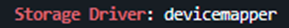

# Documentación Docker

## Instalar Docker:

### Actualizar paquetes
```sh
sudo apt update && sudo apt upgrade -y
```

### Instalar dependencias
```sh
sudo apt install -y ca-certificates curl gnupg lsb-release
```

### Agregar el repositorio de Docker
```sh
sudo mkdir -p /etc/apt/keyrings

curl -fsSL https://download.docker.com/linux/ubuntu/gpg | sudo tee /etc/apt/keyrings/docker.asc > /dev/null

echo "deb [arch=$(dpkg --print-architecture) signed-by=/etc/apt/keyrings/docker.asc] https://download.docker.com/linux/ubuntu $(lsb_release -cs) stable" | sudo tee /etc/apt/sources.list.d/docker.list > /dev/null
```

### Actualizar los paquetes
```sh
sudo apt update
```

### Ver las versiones de Docker
```sh
apt list -a docker-ce
```


### Instalar una versión específica
```sh
sudo apt install -y docker-ce=<version> docker-ce-cli=<version> containerd.io
```

---

## Correr Docker hello-world
```sh
docker run hello-world
```


---

## Ver el storage driver actual
```sh
docker info | grep "Storage Driver"
```

## Parar Docker
```sh
sudo systemctl stop docker
```

## Editar la configuración del Daemon
```sh
sudo nano /etc/docker/daemon.json
```
```json
{
  "storage-driver": "devicemapper"
}
```

## Eliminar data de Docker vieja
```sh
sudo rm -rf /var/lib/docker
```

## Iniciar Docker
```sh
sudo systemctl start docker
```

## Ver storage driver
```sh
docker info | grep "Storage Driver"
```

---

## Correr un contenedor


### Cambiar otra vez a overlay2
```sh
sudo systemctl stop docker
```

```sh
sudo nano /etc/docker/daemon.json
```
```json
{
  "storage-driver": "overlay2"
}
```

```sh
sudo systemctl start docker
```

### Verificar que devolvió
```sh
docker info | grep "Storage Driver"
```

---

## Correr una versión específica de Nginx
```sh
docker run --name my-nginx -p 8080:80 nginx:1.18.0
```

## Detener contenedor y borrarlo
```sh
docker kill 3aa969b970d8
docker rm 3aa969b970d8
```

## Correr en segundo plano
```sh
docker run -d --name my-nginx -p 8080:80 nginx:1.18.0
```

## Ver logs
```sh
docker logs -f my-nginx
```


---

## Configurar Nginx con nombre `nginx18`, reiniciar en fallos, mapear puerto 443 a 80, reservar 250M de memoria y usar la versión 1.18 de Nginx
```sh
docker run -d \
  --name nginx18 \
  --restart on-failure \
  --memory 250m \
  -p 443:80 \
  nginx:1.18.0
```


## Verificar contenedor
```sh
docker stats nginx18
```


## Parar y borrar el contenedor y correrlo con logging en journald
```sh
docker run -d --log-driver=journald --name nginx18 --restart on-failure --memory 250m -p 443:80 nginx:1.18.0
```

## Verificar el logging
```sh
journalctl -u docker.service --no-pager | grep nginx18
```

